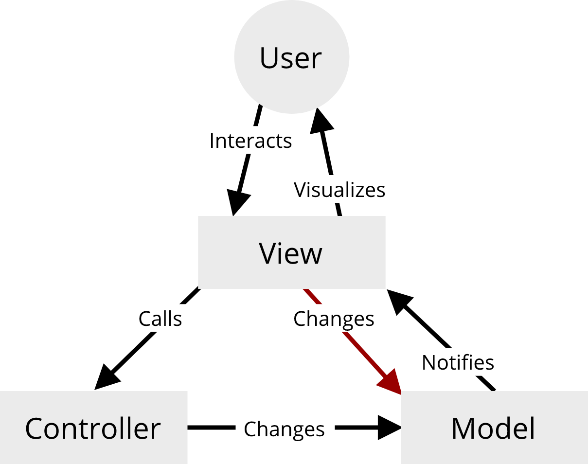

# MVC
MVC has been around in the software development world for quite a while and is a well established way to create software. It is a type of application architecture which focuses very much on separation of concerns.

## The MVC Way

A MVC (Model-View-Controller) application is, as the name suggests, divided into _Model_, _View_ and _Controller_. The following illustration represent how the data and events flow through the three components:


[MVC Wikipedia](https://en.wikipedia.org/wiki/Model–view–controller)

### Models

A Model defines and stores data and is not concerned with how this data gets presented to the user. A model has to be observable, so when the data changes views get notified and can take action accordingly. 

Puerro provides Observables which are very useful in the definition of models. The following is an example of a model in a MVC approach with pure JavaScript (No frameworks, only the Observable abstraction from Puerro):

```js
const Model = () => {
    const name = Observable('');
    const age = Observable(0);
    return {
        name,
        age,
    }
}
```

### Views

The view is used to present the model to the user. It is the only component of a frontend MVC application which interacts with the DOM. The view subscribes to changes of the model and takes the required actions in the DOM to represent the new model state.

Users interact with the view which leads to events being fired from the DOM. Relevant DOM events are listened to by the view and in turn passed to the controller if the user interaction requires a change to the model. The following code snippet is a view which could take the previous example model to represent data . The view also interacts with a controller which is introduced in the next chapter.

```js
const View = (model, controller, $form, $output) => {
    render = () => ($output.innerText = `${model.name.get()} - ${model.age.get()}`);
    
    // View-Binding
    $form.name.addEventListener('input', evt => controller.setName(evt.target.value));
    
    $form.increase.addEventListener('click', controller.increaseAge);
    $form.decrease.addEventListener('click', controller.decreaseAge);
    
    // Model-Binding
    model.name.onChange(render);
    model.age. onChange(render);
}
```

Since the view does not concern itself with how the page is rendered, it can be done in different ways. In the previous example the DOM was manipulated directly, but this is just one way of handling the view layer. It can for example also be rendered with the virtual DOM which ensures all the benefits, that the VDOM brings. The following example shows how the virtual DOM can be integrated into a view:

```js
const View = (model, controller, $form, $output) => {
    const view = () => h('div', {},
                           h('div', {}, model.name.get()),
                           h('div', {}, model.age.get())
                          );
    
    const render = name => {
        $output.replaceChild(renderVDOM(view()), $output.firstChild);
    }
    
    // same as before...
}
```

### Controllers

The controller sits between models and views and is responsible for handling updates to the model. Any and all actions which change the model have to go through the controller. Because all actions are handled by the controller, the application becomes very predictable and easier to reason about.

A controller for our example could look like the following: 

```js
const Controller = model => {
    const setName = name => {
        if (null == name || name.length === 0) {
            // handle invalid model state
        }
        model.name.set(name);
    }
    
    const setAge = age => {
        model.age.set(age);
    }
    
    const increaseAge = () => setAge(mode.age.get() + 1);
    const decreaseAge = () => setAge(mode.age.get() - 1);
    
    return {
        setName,
        increaseAge,
        decreaseAge,
    }
}
```

If the MVC architecture is combined with a revealing model pattern like in this example, we can also use private functions like `setAge`. With this the interface of the controller is clearly defined and actions exposed to the view can be limited.

### Bringing it all together

The Model, View and Controller can be separated in to their own files and initialized in a central JavaScript file which is requested by the HTML. 

```js
const model = Model();
const controller = Controller();
const view = View(model, 
                  controller,
                  document.getElementById('form'),
                  document.getElementById('output')
                 );
```

As evident by this whole example, MVC can generate some boilerplate code which seems over the top for small applications. But especially when the application scales, the advantages become very visible, the business logic sits in one place and the model cannot be changed but through this business logic. Especially compared to the just mutating the DOM and application state from anywhere in the code this approach makes the application way more predictable and easier to understand.

## Bidirectional binding

As visible in this visualization of the MVC flow, data and user input always flows unidirectionally. This makes the application easier to reason about and more predictable, since the model cannot just be changed from anywhere. 

Many modern frontend frameworks like Vue.JS and Angular (not React) work with bidirectional bindings of data. This is intuitive at first but as an application grows can become very unpredictable. The model can be changed from anywhere and business logic has to be enforced with different approaches, for example in Vue.JS using [watchers](https://vuejs.org/v2/guide/computed.html#Watchers).

MVC does not permit bidirectional binding by design which might feel like a restriction from time to time but is essential to prevent bugs and keep the codebase understandable and maintainable. If it would allow bidirectional binding the graph would look like this:



This would defeat the whole purpose of the controller, by leaving it out. With this architecture we can never be quite sure that all the necessary business logic is executed.

## Testability

As mentioned, the separation of concerns leads to increased testability. The Controller and the view can be tested independently and the controller even without mocking DOM objects.


- controller
- seperation of concerns
- cycle
- bidirectional vs unidirectional

mvc only concept: 
- possible to combine with dom manipulation, vDom/Components

- restrictions:
- global store