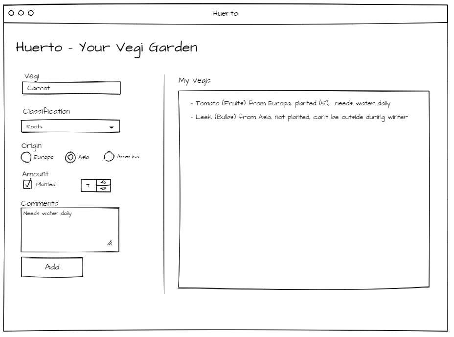

# Season 02 - Getting Input

## Conversation

> > **Customer**: Wow! That was quick!
>
> > **Developer**: Sure thing, that's because I didn't had to use a framework for it.
>
> > **Customer**: A framewhat? Nevermind. Tell you what, three tomates have already grown on my tomato vine. Now I also want to know how many pieces of each vegetable I own. Could you let me add the amount as well?
>
> > **Developer**: For sure! Anything else?
>
> > **Customer**: Perfect! Yes, since I also add vegetables which I didn't plant yet, could you make sure, that I only need to fill out the amount if I already planted it? I would also like to save some additional information about my vegis. Like the classification, origin and maybe some additional comments. Oh, and before I forget.. It took me a while to figure out that I need to press _Enter_ to submit my entry. Could you please add an _Add_ button for me?
>
> > **Developer**: Okey, let me see.. So it should look something like this:  The _amount_ input will disappear if _planted_ is unchecked.
>
> > **Customer**: Exactly, you're the best!

## Development Process

- Should I use a `<form>`?
- What would be the best way to conditionally show the amount-field?
- This is getting quite complicated, maybe I should draw out how the form inputs interact with each other.

## Result

### Form

Using a `form` tag has many advantages, some of them are the following:

- Ability to [reset](https://developer.mozilla.org/en-US/docs/Web/API/HTMLFormElement/reset) the whole form
- Ability check the validity of all form elements if HTML5 validation is used
- Ability to get all form [elements](https://developer.mozilla.org/en-US/docs/Web/API/HTMLFormElement/elements) within the form without knowing the elements specifically
- Increased accessibility for screen readers
- Better usability on smartphones (chaing keyboard to support submit)

All of these contributed to desicion to use `form` tags for our project.

### Conditionally show fields

For now the fastest and easiest way is to listen to events of one field and with that information toggle the visibility of others.

### Diagram

| Implementation (Demo)           | Test Results           |
| ------------------------------- | ---------------------- |
| [02 - Getting input](demo.html) | [Tests 02](tests.html) |
